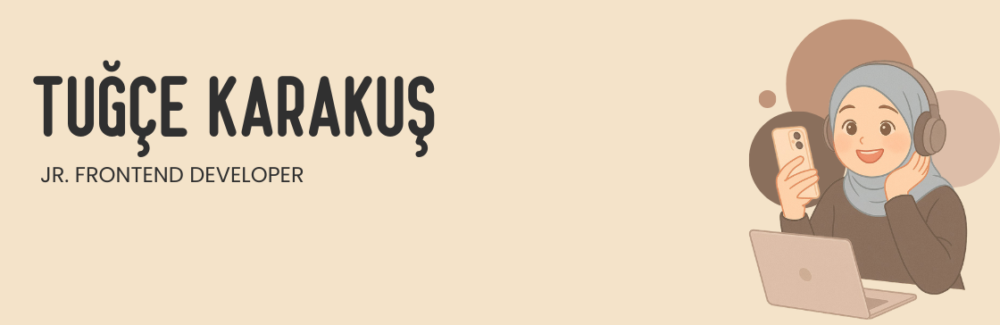

<h1 id="hi-im-tugce-">Merhaba, Ben Tuğçe👋🏻 👩🏻‍💻</h1>

Merhaba! 
Ben front-end dünyasında yolculuğuna başlamış, öğrenmeye açık ve hevesli bir geliştiriciyim. Bu GitHub hesabında, kendimi geliştirmek için üzerinde çalıştığım projeleri ve öğrendiğim şeyleri paylaşıyorum. Her gün biraz daha ilerlemek, yeni teknolojiler öğrenmek ve bu süreci paylaşmak benim için çok keyifli. 
Uğradığın için teşekkür ederim! 🌱

<h2 id="find-me">Buralardayım🌎:  </a></h2>
<ul>
   
<li>İletişime geçmek istersen buradayım   <a href="mailto:tugcekarakus0038@gmail.com">Mail</a> 📩</li>
<li>LinkedIn’deyim, beklerim  <a href="https://www.linkedin.com/in/monicampowell/">LinkedIn</a> 💼</li>
<li> Merak edersen diye bıraktım şuraya:    <a href="tugcekarakus.com">Portfolyom</a> 🖥️</li> 
</ul>

