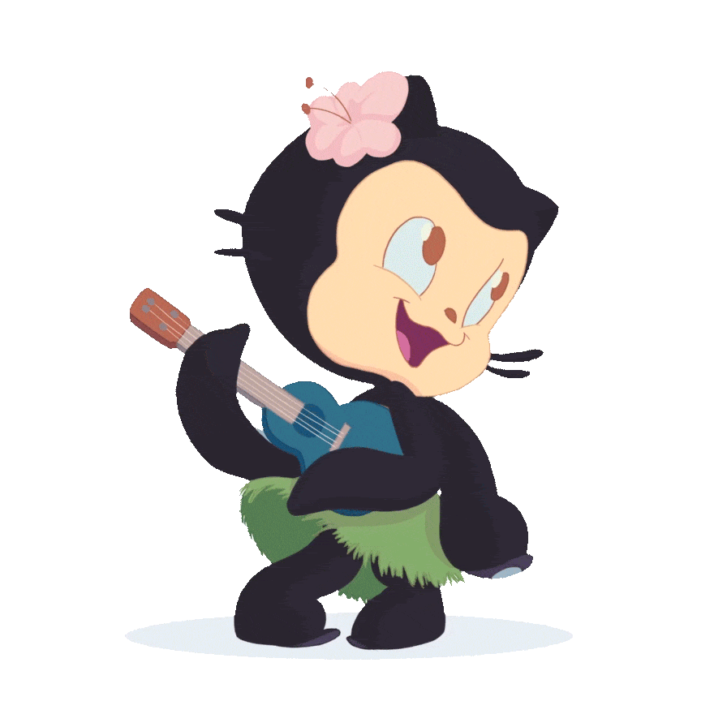

<h1 align="center">Hey, I'm Tugce Karakus 👩🏻‍💻</h1>

 

I’m a junior frontend developer focused on building responsive, accessible, and user-friendly web experiences with React and modern frontend technologies.

I enjoy turning designs into functional interfaces, exploring better ways to structure frontend applications, and improving with every project I build.

 

<h2>Tech Stack</h2>

<h3>Frontend</h3>

  
  
  
  
  
  
  
  
  

<h3>Tools</h3>

  

 

<h2>What I'm Working On</h2>

- <strong>OpenFashion:</strong>  Building a responsive eCommerce application with React and Tailwind CSS.
- <strong>CineVault:</strong> Developing a movie discovery application with React.
- Exploring scalable component architecture, state management, and reusable UI patterns.

 

<h2>Connect With Me</h2>

- 📩 <strong>Email:</strong> [tugcekarakus0038@gmail.com](mailto:tugcekarakus0038@gmail.com)
- 🖥️ <strong>Portfolio:</strong> [tugcekarakus.vercel.app](https://tugcekarakus.vercel.app/)
- 💼 <strong>LinkedIn:</strong> [linkedin.com/in/tugceekarakus](https://www.linkedin.com/in/tugceekarakus/)
- 🧩 <strong>Frontend Mentor:</strong> [frontendmentor.io/profile/tugcekarakuss](https://www.frontendmentor.io/profile/tugcekarakuss)
- 🎨 <strong>Figma:</strong> [figma.com/@tugcekarakus](https://www.figma.com/@tugcekarakus)

  

